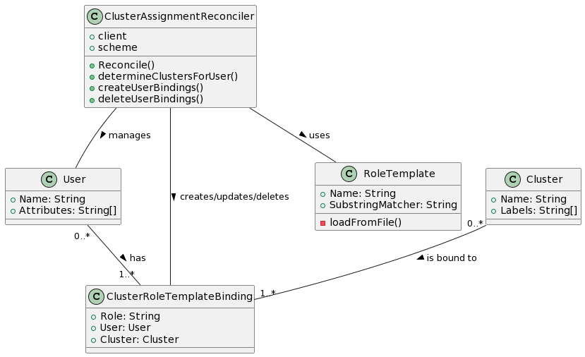

# Building and Deploying the Rancher User Role Operator

## Introduction

The Rancher User Role Operator, also known as the ClusterAssignment Operator, is a specialized Kubernetes operator designed to seamlessly manage permissions and role assignments for users within a Rancher environment. As Kubernetes clusters dynamically evolve, user roles need constant adaptation. This operator ensures that users are granted permissions consistent with their attributes, and role assignments are maintained even amid environment changes.

The operator achieves this by watching changes in User resources, evaluating roles based on user attributes or groups, and subsequently updating the ClusterRoleTemplateBinding resources.

## Importance

- **Consistency**: Ensures role assignments align with the current state of the environment and user attributes.
- **Dynamism**: Adapts user permissions in real-time as the Kubernetes environment undergoes changes.
- **Granularity**: Assigns roles based on detailed templates and user attributes, allowing for precise access control.
- **Ease of Management**: Minimizes administrative overhead by automating role binding updates upon user permission changes or new user addition.

## Architecture



## Workflow and Key Components

- **ClusterAssignmentReconciler**: This is the core reconciler responsible for observing User objects. Every reconciliation loop inspects the user's state and updates role bindings accordingly.
- **Role Templates**: Default role templates, such as cluster-admin, cluster-auditor, and developer, are employed to assign roles to users. Additionally, there's the flexibility to load external role templates from a file.
- **Helper Functions**:
    - `contains`: Checks for the presence of a substring within a string.
    - `readFileIfExists`: Reads content from a file if it exists.
    - `parseRoleTemplatesFile`: Processes the role templates JSON file to extract role mappings.
- **Reconciliation Cycle**: Upon detecting changes to User custom resources:
    - The user corresponding to the change is fetched.
    - Role bindings get updated or deleted based on the user's state.
    - The necessary ClusterRoleTemplateBinding resources for the user are either created or updated.
- **Role Template Loading**: Either uses default templates or loads from an external JSON file (roleTemplates.json).
- **Binding Creation/Update & Deletion**: ClusterRoleTemplateBinding resources are managed based on user attributes and role templates.
- **Configuration**: A configuration file `/config/roleTemplates.json` can be used to customize role templates.

## Permissions

This operator leans heavily on the `management.cattle.io/v3` API and permissions to ensure a smooth integration with Rancher resources. The extensive RBAC permissions spread across various resources allow the operator to manage users, clusters, role bindings, and other affiliated resources.

## Logging

The codebase utilizes a global logger, `globalLog`, to disseminate information, warnings, and errors. Diverse logging levels provide fine-grained control over log verbosity.

## Future Work (TODO)

- Enhance the `determineClustersForUser` function to better integrate with Single Sign-On (SSO) capabilities.

## Deployment Steps

**Generate Manifest for Kustomize**:

```bash
make manifests
```
- Description: Generates required manifests for Kustomize deployment.

**Build and Push Docker Image**:

```bash
make docker-build docker-push
```
- Description: Compiles the operator code, produces the Docker image, and pushes the image to a designated Docker registry.

**Deploy with a Dry-Run**:

```bash
make deploy-dry-run
```
- Description: Simulates a deployment, creating a file(config/deploy-dry-run/install.yaml) containing all Kubernetes objects needed for deployment.

## User Permissions Matrix in Rancher

| Action/Resource | cluster-admin | cluster-auditor (read-only) | developer (projects-create) |
|-----------------|:-------------:|:---------------------------:|:---------------------------:|
| **Clusters**    |               |                             |                             |
| Create          |       ✓       |                             |                             |
| Read            |       ✓       |              ✓              |              ✓              |
| Update          |       ✓       |                             |                             |
| Delete          |       ✓       |                             |                             |
| **Projects**    |               |                             |                             |
| Create          |       ✓       |                             |              ✓              |
| Read            |       ✓       |              ✓              |              ✓              |
| Update          |       ✓       |                             |              ✓              |
| Delete          |       ✓       |                             |                             |
| **Nodes**       |               |                             |                             |
| Create          |       ✓       |                             |                             |
| Read            |       ✓       |              ✓              |              ✓              |
| Update          |       ✓       |                             |                             |
| Delete          |       ✓       |                             |                             |
| **Workloads**   |               |                             |                             |
| Create          |       ✓       |                             |              ✓              |
| Read            |       ✓       |              ✓              |              ✓              |
| Update          |       ✓       |                             |              ✓              |
| Delete          |       ✓       |                             |                             |

### Description:

1. **cluster-admin**:
    - This is a superuser role within Rancher and typically grants all permissions to clusters, projects, nodes, and workloads. They can perform CRUD (Create, Read, Update, Delete) operations on most, if not all, resources.

2. **cluster-auditor (read-only)**:
    - As the name suggests, this role is primarily focused on viewing resources without making any modifications. This is useful for users who need oversight or auditing capabilities but shouldn't change the system's configuration.

3. **developer (projects-create)**:
    - Users with this role can create projects, which are collections of namespaces in Rancher. In addition to creating projects, they can also read and potentially update them. They might also have visibility into workloads and nodes, but their primary capability is related to project management.
